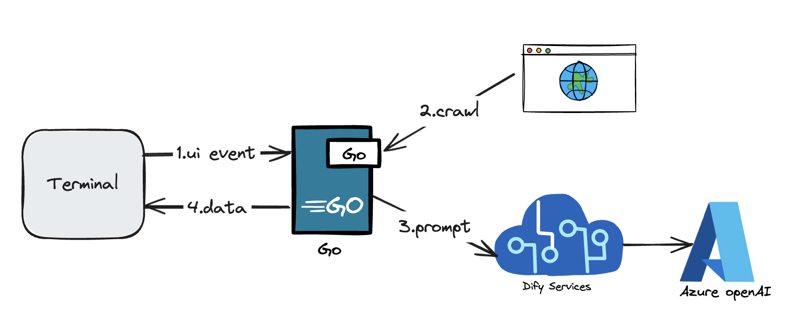
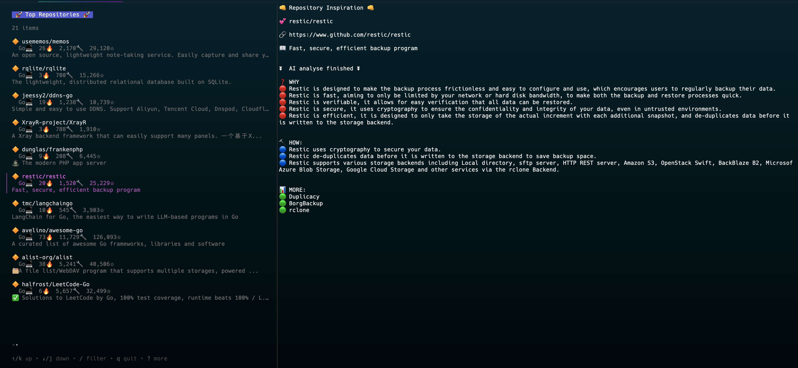

# gitoday
This is a straightforward CLI tool that fetches most excited GitHub repositories about today by programming language. It also offers AI-powered analysis of these repositories, summarizing the information in a reader-friendly format.
## Background
When browsing GitHub trending, the project descriptions only provide a vague idea of what the project is about. However, if a project makes it to the trending list, it certainly has some *special aspects*. At this point, I often need to click into the respective repository to browse its README. But the README is usually more developer-oriented, and I just want to quickly understand the highlights of the project and what pain points it solves. This information helps me decide whether I'm interested in delving deeper into the project content. By using the *HOW* and *WHY* questioning approachto generate a summary for the project. 
## Installation
1. source code
   - Clone the repository
   - Run `go mod tidy`
   - Run `go build -o gitoday`
   - Run `./gitoday -apiKey="xxx"`
## Usage

## Document


1. Choose the programming language you are interested in from the list in the CLI.
2. Fetch the trending repositories from GitHub.
3. Analyze the repositories using Azure openAI by dify service.
4. Display the analysis results in the CLI.


## Debugger
```bash
$ dlv debug --headless --api-version=2 --listen=127.0.0.1:43000 .
API server listening at: 127.0.0.1:43000
```
```bash
# Connect to it from another terminal
$ dlv connect 127.0.0.1:43000
```
## License
MIT
